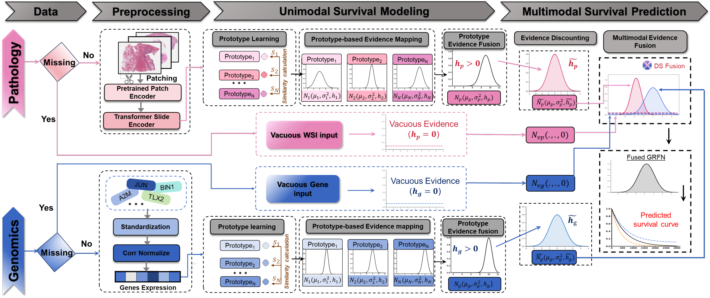

# EMMS

## Evidential Fusion Network for Multimodal Survival Prediction under Missing Modalities

*MICCAI 2026*

Yucheng Xing, Hailan Mo, Zi Wang, Ling Huang, Mengling Feng

[arXiv](https://arxiv.org/abs/2606.20757) | [Cite](#cite)

**Abstract:** Recent multimodal survival prediction models have demonstrated strong
predictive performance by leveraging complementary information across modalities.
However, such models generally assume data completeness and exhibit limited
robustness toward missing modalities, which are frequently encountered in
real-world clinical settings. We propose the Evidential Missing Modality Survival
Fusion (EMMS) model for multimodal survival prediction under missing modalities.
EMMS offers a straightforward, computationally effective approach to survival
analysis without requiring a generative phase for missing data. By employing
Dempster-Shafer theory and Gaussian Random Fuzzy Numbers for multimodal decision
fusion, it considers both aleatoric and epistemic uncertainty alongside modality
reliability for fusion. Moreover, the model treats missing modalities as vacuous
evidence, preventing interference with available inputs and naturally reflecting
increased uncertainty and calibrated predictions. Extensive experiments on four
cancer datasets demonstrate state-of-the-art performance while providing calibrated
and interpretable uncertainty estimates under incomplete multimodal observations,
without introducing additional computational overhead.

This repo runs the WSI + RNA setting. Each modality produces survival evidence
(Dempster-Shafer / Gaussian random fuzzy numbers); a missing modality is treated as
vacuous evidence (h = 0) and simply drops out of the fusion.

## Install

    conda create -n emms python=3.10
    conda activate emms
    pip install -r requirements.txt

Main deps: torch, scikit-learn, scikit-survival, pycox, lifelines. Everything runs
on CPU; one cancer (5 folds, 70 epochs) takes a few minutes.

## Data

Everything is read from `data/`:

- `titan_embeddings/` - one `.pt` per patient (TITAN WSI embedding, 768-d), named
  `TCGA-XX-XXXX.pt`. Not shipped with this repo: the Mahmood Lab released
  precomputed TITAN features for all of TCGA as `TCGA_TITAN_features.pkl` on
  [huggingface.co/MahmoodLab/TITAN](https://huggingface.co/MahmoodLab/TITAN), so the
  slides never have to be encoded. `python scripts/prepare_titan_features.py`
  fetches that file and writes it out per patient.
- `data_csvs/rna/hallmarks/<CANCER>/rna_clean.csv` - gene expression
- `splits/survival/TCGA_<CANCER>_overall_survival_k=<0..4>/` - `train.csv`, `test.csv`

Cancers: BRCA, LUAD, STAD, KIRC.

## Run

All four cancers, 5-fold, no missing modality:

    python scripts/run.py

One cancer:

    python scripts/run.py --cancer_type KIRC

Drop modalities on the training split (paired samples, 60% total):

    python scripts/run.py --cancer_type KIRC --missing_config_train WSI:0.3_RNA:0.3

`--missing_config_train` presets: `WSI:0.0_RNA:0.6`, `WSI:0.2_RNA:0.4`,
`WSI:0.3_RNA:0.3`, `WSI:0.4_RNA:0.2`, `WSI:0.6_RNA:0.0`.

The script takes one missing config at a time, so loop over them in the shell.
All five missing configs for one cancer (PowerShell):

    foreach ($cfg in "WSI:0.0_RNA:0.6","WSI:0.2_RNA:0.4","WSI:0.3_RNA:0.3","WSI:0.4_RNA:0.2","WSI:0.6_RNA:0.0") {
        python scripts/run.py --cancer_type KIRC --missing_config_train $cfg
    }

All five missing configs for all four cancers (drop `--cancer_type`):

    foreach ($cfg in "WSI:0.0_RNA:0.6","WSI:0.2_RNA:0.4","WSI:0.3_RNA:0.3","WSI:0.4_RNA:0.2","WSI:0.6_RNA:0.0") {
        python scripts/run.py --missing_config_train $cfg
    }

Each config writes to its own folder (`results/missing_W0_R6/`, `missing_W2_R4`,
...), so the runs do not overwrite each other.

Other flags:

- `--align_weight` - KL alignment loss on complete cases (default 0.01; pass 0.0 to turn off)
- `--rna_gamma_scale` - RBF gamma scaling (default 0.3)
- `--output_dir` - override the output path

The rest (K=50, 70 epochs, lr 0.011, batch 256, seed 123) is in
`configs/default_config.py`.

## Output

Written under `results/`. No missing config goes to
`results/missing_modality_W0_R0/<CANCER>/`; a missing config encodes the rates in
the folder name, e.g. `WSI:0.3_RNA:0.3` -> `results/missing_W3_R3/<CANCER>/`.

Each folder has:

- `detailed_results.csv` - one row per fold / test scenario / lambda
- `summary_results.csv` - mean and std over the 5 folds
- `best_model_k0.pth` ... `best_model_k4.pth`

Every trained model is tested under three scenarios (RNA only, WSI only, both) and
over lambda in [0, 1]; each row reports C-index, IBS and NBLL.

## Notebook

`scripts/pipeline.ipynb` runs the same thing for a single cancer, which is easier to
read through one fold at a time. Edit the config cell (`CANCER`, `MISSING_CONFIG`,
`ALIGN_WEIGHT`) and run all cells. The shipped example is KIRC with
`WSI:0.3_RNA:0.3` missing on train, tested on the complete set.

## Acknowledgements

The WSI embeddings come from [TITAN](https://github.com/mahmoodlab/TITAN) (Mahmood
Lab), a multimodal whole-slide foundation model for pathology. We use their
released TCGA features directly and thank the authors for making them public. The
features are CC-BY-NC-ND 4.0, for non-commercial academic use.

    @article{ding2025multimodal,
      title={A multimodal whole-slide foundation model for pathology},
      author={Ding, Tong and Wagner, Sophia J and Song, Andrew H and Chen, Richard J and Lu, Ming Y and Zhang, Andrew and Vaidya, Anurag J and Jaume, Guillaume and Shaban, Muhammad and Kim, Ahrong and others},
      journal={Nature Medicine},
      pages={1--13},
      year={2025},
      publisher={Nature Publishing Group US New York}
    }

## Cite

    @inproceedings{xing2026evidential,
      title={Evidential Fusion Network for Multimodal Survival Prediction under Missing Modalities},
      author={Xing, Yucheng and Mo, Hailan and Wang, Zi and Huang, Ling and Feng, Mengling},
      booktitle={Medical Image Computing and Computer Assisted Intervention (MICCAI)},
      year={2026}
    }
